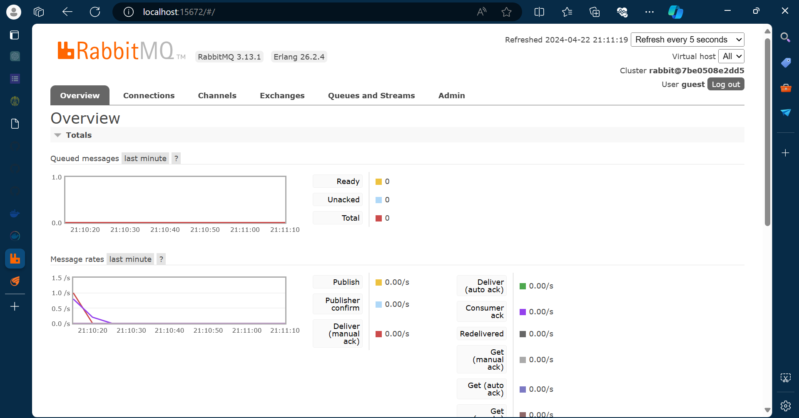
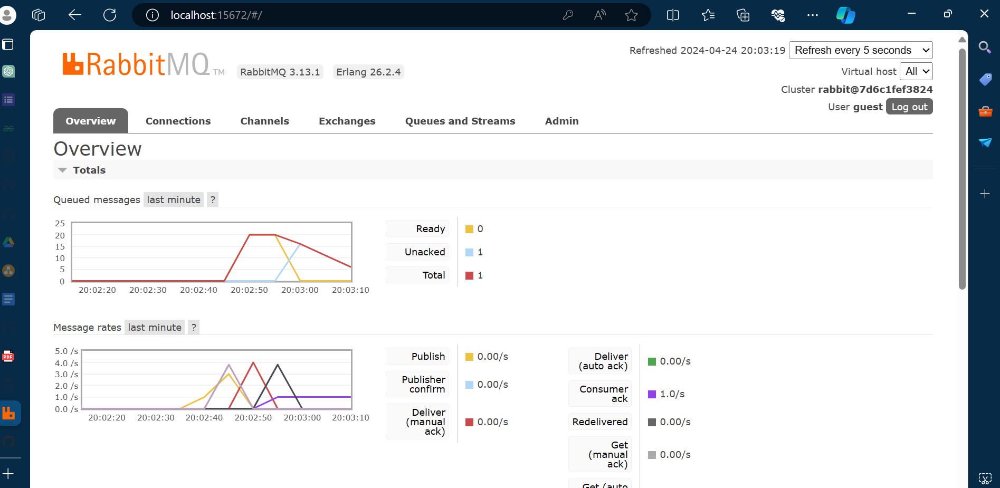
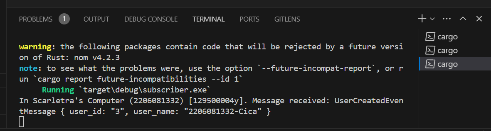

a. What is amqp?
- AMQP (Advanded Message Queuing Protocol) adalah protokol perangkat lunak yang dirancang untuk mendukung komunikasi yang efisien, handal, dan aman antara berbagai aplikasi atau sistem yang terhubung dalam arsitektur berbasis message queuing.

b. What it means? guest:guest@localhost:5672 , what is the first quest, and what is the second guest, and what is localhost:5672 is for? 
String guest:guest@localhost:5672 adalah string untuk koneksi pada AMQP server. guest:guest menandakan username dan juga password untuk servernya. localhost merupakan hostname dari servernya dan 5672 merupakan port number yang digunakan ketika server dijalankan (port number default AMQP)

Screen capture ketika mensimulasikan subscriber yang lambat (slow subscriber)

Pada capture kali ini, saya menjalankan 3 subscriber sekaligus sehingga spike dari message queue menjadi berkurang dari sebelumnya. Hal ini bisa terjadi karena request dari queue yang diterima akan terbagi ke 3 subscriber

Terdapat beberapa perbaikan yang bisa dilakukan:
1. Menggunakan match untuk menangani kesalahan saat program dijalankan. Berbeda dengan yang digunakan sekarang ini yaitu dengan menggunakan method unwrap() bisa menyebabkan panic saat resultnya adalah err.
2. Pendefinisian variabel tertentu untuk hal yang digunakan secara berulang-berulang, sehingga penulisan kode menjadi lebih rapih dan mudah untuk dilihat